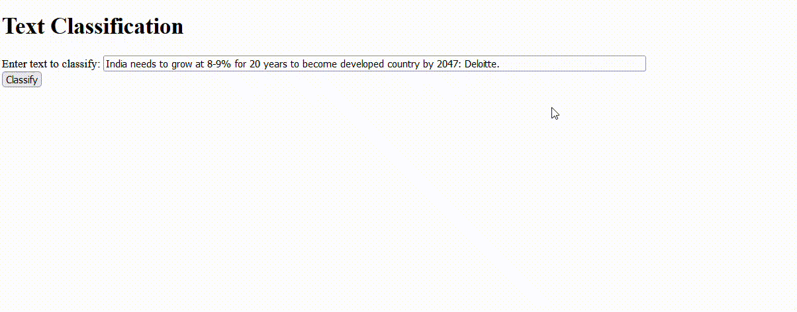
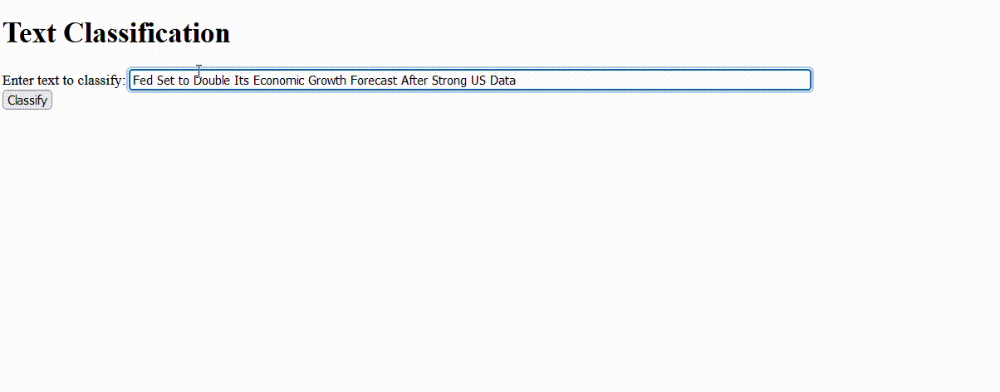

# Text Classification Project: US Economy News Relevance Classifier

## Project Description

In today's fast-paced digital world, staying updated with relevant news is crucial. For businesses, investors, and policymakers, it is essential to filter through a vast amount of news articles and focus on those directly related to the US economy. This project addresses this challenge by creating a text classification model that can automatically identify whether a given news article is pertinent to the US economy.

